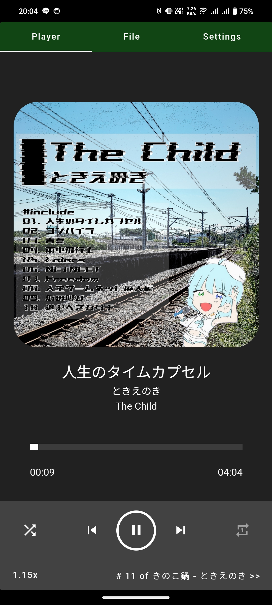
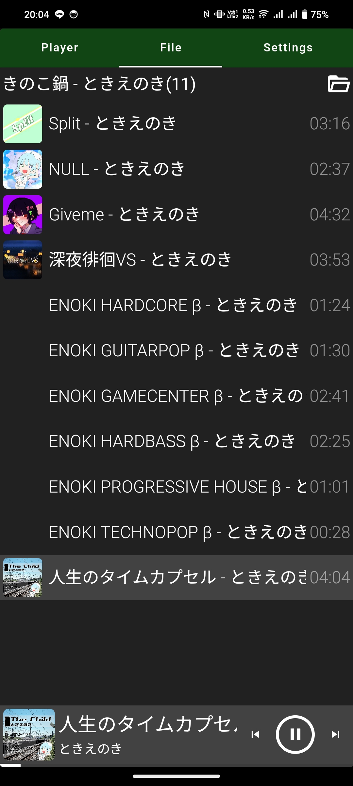

# ときえのきミュージックプレイヤー

ときえのきの曲が聞き放題！

<a href="https://enoki.xyz" target="_blank">
  
</a>

## 何ができる？

Android 向けミュージックプレイヤーアプリ

## 特徴

- 私[ときえのき](https://enoki.xyz)が自作した楽曲をオフラインで再生できます
- フォルダ単位で楽曲を管理・再生できます
- シャッフル再生・リピート再生・再生速度変更に対応
- ID3タグ（タイトル・アーティスト・アルバム・サムネイル）に対応
- ダークテーマ対応

## スクリーンショット



## Download

[ここをクリックしてダウンロード](https://raw.githubusercontent.com/jikantoki/jikantokiMusicPlayer/refs/heads/master/release/app-release.apk)

## 技術スタック

Vue.js + Capacitor で Android ネイティブアプリを構築

## 仕組み

[Capacitor](https://capacitorjs.com/) を使用して Vue.js アプリを Android ネイティブアプリとしてパッケージング

## 使用技術

- Vue 3 + TypeScript
- Vuetify 3
- Vue Router 5
- Pug（テンプレートエンジン）
- SCSS/SASS
- Vite（ビルドツール）
- Capacitor 8
- Capacitor Filesystem / Toast / Music Controls
- mp3tag.js（ID3タグ読み込み）

## 対応 OS

Android

## ファイル構成

```text
/
├── android/                      # Android プロジェクト（Capacitor生成）
├── assets/                       # アプリアイコン素材
├── capacitor.config.json         # Capacitor 本番設定
├── capacitor.config-DEBUG.json   # Capacitor デバッグ用設定（ライブリロード）
├── public/                       # 静的ファイル
│   ├── assets/
│   │   └── screenshots/          # スクリーンショット画像
│   ├── manifest.json
│   ├── serviceWorker.js
│   └── thumbnail_default.jpg     # デフォルトサムネイル
├── release/                      # リリース APK
├── src/                          # ソースコード
│   ├── App.vue                   # アプリルート
│   ├── components/
│   │   ├── aboutTab.vue          # About 画面
│   │   ├── filesTab.vue          # ファイル一覧画面
│   │   ├── folderPicker.vue      # フォルダ選択
│   │   └── playerTab.vue         # プレイヤー画面
│   ├── main.ts
│   ├── plugins/                  # Vuetify・フォント初期化
│   ├── router.ts
│   ├── styles/
│   │   └── settings.scss         # Vuetify グローバル設定
│   └── views/
│       └── indexPage.vue         # メインページ（タブ管理）
├── index.html
├── package.json
└── vite.config.mts               # Vite 設定
```

## Project setup

```shell
npm install
```

### AndroidManifest.xml に以下の記述があることを確認する

場所: `/android/app/src/main/AndroidManifest.xml`

```xml
<manifest>
  <uses-permission
    android:name="android.permission.READ_EXTERNAL_STORAGE"
    android:maxSdkVersion="32"
  />
  <uses-permission
    android:name="android.permission.WRITE_EXTERNAL_STORAGE"
    android:maxSdkVersion="32"
  />
  <uses-permission android:name="android.permission.READ_MEDIA_AUDIO" />
</manifest>
```

### ブラウザ上での動作確認

```shell
npm run dev
```

開発サーバーが `http://localhost:3030` で起動します。

ライブリロードしながら実機確認する場合は `capacitor.config-DEBUG.json` の `server.url` をこの PC のローカル IP:3030 に変更してから DEBUG 用 APK をビルドしてください。

### ソースを dist に出力

```shell
npm run build
```

### Android 用にコンパイル

```shell
npx cap add android   # 初回のみ必要
npx cap sync          # ビルド結果を Android プロジェクトに同期
npx cap open android  # Android Studio を起動してビルド・実行
```

### Lint

```shell
npm run lint
```
